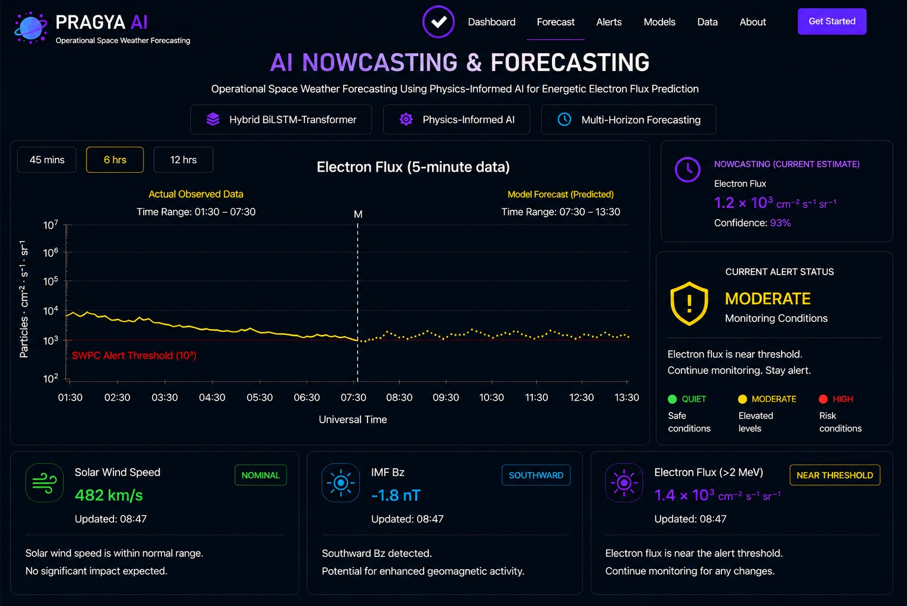
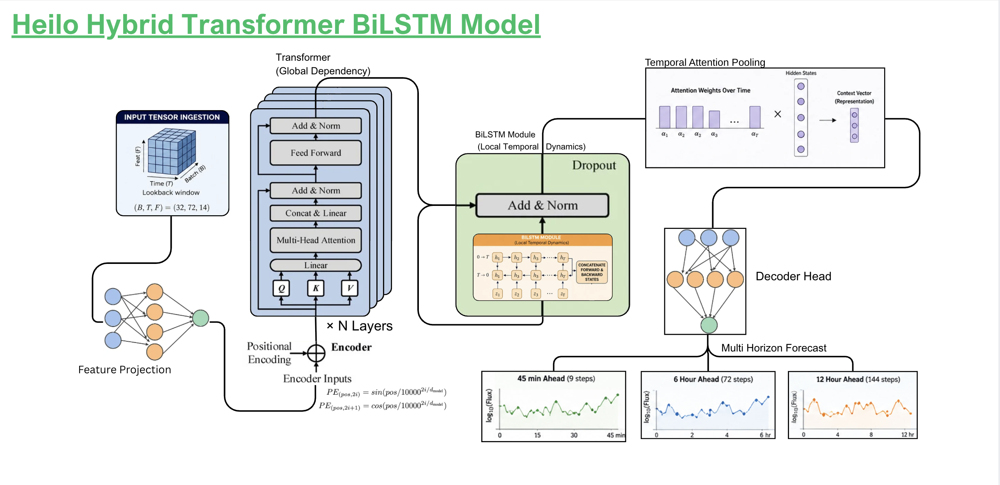
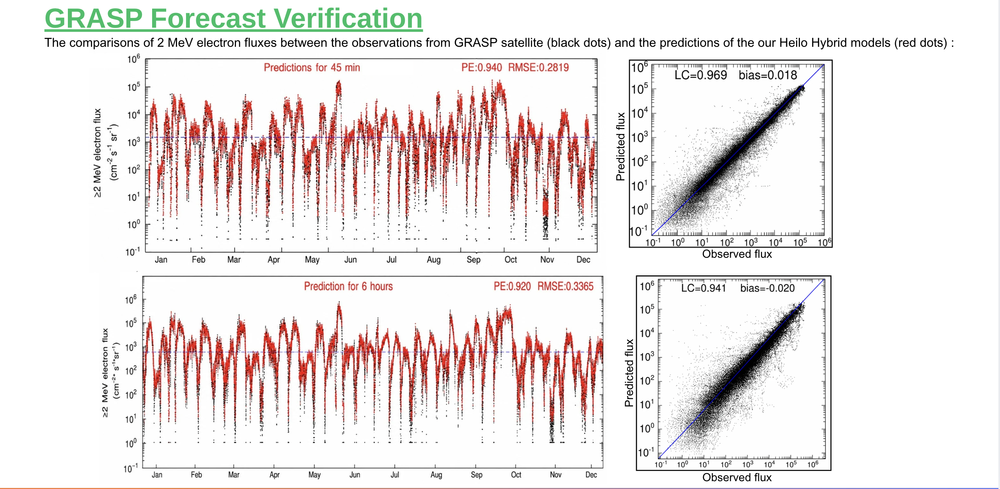
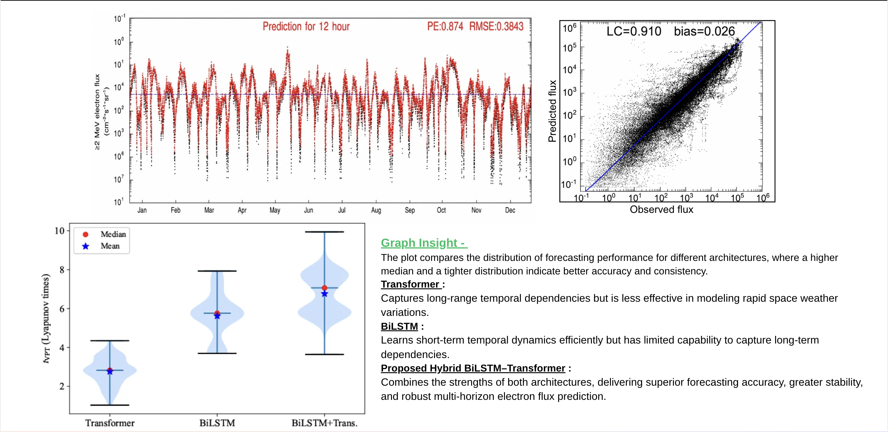

# PRAGYA AI
### Predictive Radiation Analysis for Geostationary Applications

> Physics-Informed Multi-Horizon Forecasting of Energetic Electron Fluxes for ISRO's Geostationary Satellites

---

## Overview

PRAGYA AI is a physics-informed deep learning framework designed to forecast energetic (>2 MeV) electron fluxes at geostationary orbit.

The system combines historical GOES electron flux measurements with upstream solar wind observations from the WIND spacecraft to generate reliable forecasts at multiple prediction horizons.

Unlike traditional forecasting systems that rely solely on computationally intensive physics simulations or purely data-driven machine learning models, PRAGYA AI integrates heliophysics knowledge directly into the learning pipeline to improve robustness, interpretability, and operational reliability during extreme space weather events.

### Forecast Horizons

- ⚡ **45 Minutes**
- ⏳ **6 Hours**
- 🌍 **12 Hours**

---

# Dashboard Preview

The PRAGYA AI dashboard provides real-time visualization of energetic electron flux forecasts, operational alerts, confidence estimation, and important solar wind parameters through a single interface.

<p align="center">
  
</p>

---

# Problem Statement

Energetic electrons trapped within Earth's outer radiation belt pose a serious threat to geostationary satellites by causing

- Surface charging
- Deep dielectric charging
- Solar panel degradation
- Electronic component failures

Predicting these high-energy particle environments before severe geomagnetic disturbances allows satellite operators to take preventive measures and reduce mission risk.

PRAGYA AI addresses this challenge by combining physical understanding of the magnetosphere with modern deep learning architectures for operational space weather forecasting.

---

# Project Goals

- Read and process GOES and WIND satellite CDF datasets
- Build a robust preprocessing pipeline
- Engineer physically meaningful features
- Train a hybrid Transformer–BiLSTM forecasting model
- Generate multi-horizon forecasts
- Estimate prediction uncertainty
- Produce operational risk alerts
- Validate predictions against ISRO GRASP observations

---

# Dataset

## GOES

- >2 MeV Electron Flux
- 11 Years
- 5-minute cadence
- CDF Format

---

## WIND

Solar Wind Parameters

- Solar Wind Speed
- Plasma Density
- IMF Components
- Magnetic Field Strength

11 Years of observations

---

## ISRO GRASP

Used exclusively for independent model validation.

---

# Overall Pipeline

```text
GOES CDF
          \
           \
            ---> Data Ingestion
           /
WIND CDF /

↓

Physics-Based Time Alignment

↓

Quality Control

↓

Gap Handling

↓

Feature Engineering

↓

Feature Selection

↓

Sliding Window Construction

↓

Hybrid Forecast Model

↓

Multi-Horizon Prediction

↓

Physics Constraints

↓

Uncertainty Estimation

↓

Operational Alerts

↓

Visualization Dashboard
```

---

# Hybrid Forecasting Architecture

The forecasting engine combines Transformer-based global temporal modeling with BiLSTM-based local sequence learning to capture both long-term radiation belt evolution and rapid geomagnetic disturbances.

<p align="center">
  
</p>

---

# System Architecture

The complete forecasting system is divided into five independent modules.

```text
Satellite Data
      │
      ▼
Preprocessing Pipeline
      │
      ▼
Feature Engineering
      │
      ▼
Hybrid Forecast Engine
      │
      ▼
Operational Decision Support
```

Each module is independently developed, tested, and optimized to simplify maintenance and future improvements.

---

# Phase 1 — Data Preprocessing

The preprocessing pipeline transforms raw satellite telemetry into machine-learning-ready tensors.

### Reading CDF Files

- Parse GOES observations
- Parse WIND observations
- Convert timestamps
- Merge datasets

### Physics-Based Time Alignment

Solar wind measurements collected near the L1 point require approximately 30–80 minutes to reach geostationary orbit.

Instead of directly matching timestamps, observations are shifted using solar wind propagation delay, eliminating look-ahead bias during training.

### Data Cleaning

- Remove corrupted measurements
- Detect and eliminate spikes
- Handle missing observations
- Cross-calibrate multiple satellites

### Gap Handling

- Short gaps → Linear interpolation
- Medium gaps → Physics-based exponential decay
- Long gaps → Excluded from training

### Feature Engineering

Important derived physical variables include

- Dynamic Pressure
- Southward IMF
- Solar Wind Electric Field
- Newell Coupling Function
- Magnetic Local Time

### Feature Selection

Features are selected using

- Mutual Information
- Correlation Analysis
- Physical significance

### Sequence Generation

Historical observations are converted into sliding windows for supervised learning.

```
Past Observations

↓

Sliding Window

↓

Prediction Targets

45 min
6 hr
12 hr
```

---

# Phase 2 — Forecasting Engine

The forecasting engine combines recurrent neural networks with transformers.

```text
Input Tensor

↓

Feature Projection

↓

Transformer Encoder

↓

BiLSTM Encoder

↓

Temporal Attention Pooling

↓

Shared Representation

↓

Decoder

├── 45 Minutes

├── 6 Hours

└── 12 Hours
```

## Why Hybrid?

### Transformer

- Learns global temporal dependencies
- Captures long-term radiation belt evolution

### BiLSTM

- Learns local temporal dynamics
- Models rapid geomagnetic disturbances

The hybrid architecture combines both strengths, producing stable and accurate forecasts across multiple prediction horizons.

---

# Multi-Horizon Forecasting

Instead of training separate models for different lead times, PRAGYA AI predicts all forecasting horizons simultaneously from a shared latent representation.

This improves temporal consistency while reducing computational complexity.

---

# Model Validation

The trained model is evaluated against independent GRASP observations to verify forecasting accuracy across multiple prediction horizons.

The figure below compares observed and predicted energetic electron fluxes for the 45-minute and 6-hour forecasts.

<p align="center">
  
</p>

---

# Phase 3 — Post Processing

Raw neural network outputs are converted into operational forecasts through a lightweight post-processing pipeline.

This stage includes

- Adaptive bias correction
- Physical constraints
- Confidence estimation
- Operational risk classification

### Adaptive Learning

Recent prediction errors are continuously monitored using rolling statistics to compensate for

- Sensor drift
- Seasonal variation
- Solar cycle changes

without retraining the neural network.

### Physics Constraints

Operational forecasts are constrained to remain physically realistic.

Examples include

- Non-negative flux
- Maximum allowable flux
- Maximum decay rate

### Confidence Estimation

Prediction uncertainty is estimated using rolling historical error statistics, allowing every forecast to include confidence bounds.

---

# Risk Classification

Forecasts are translated into operational alerts.

| Level | Description |
|--------|-------------|
| 🟢 Green | Normal Conditions |
| 🟡 Yellow | Elevated Radiation Risk |
| 🔴 Red | Severe Radiation Environment |

---

# Benchmark Comparison

The proposed Hybrid Transformer–BiLSTM architecture is benchmarked against standalone Transformer and BiLSTM models.

The hybrid architecture consistently demonstrates improved forecasting stability while maintaining higher accuracy across all prediction horizons.

<p align="center">
  
</p>

---

# Visualization

The dashboard provides

- Live Electron Flux Forecasts
- Historical Observations
- Multi-Horizon Predictions
- Confidence Estimation
- Solar Wind Monitoring
- Radiation Risk Alerts
- Operational Decision Support

---

# Repository Structure

```text
PRAGYA-AI/

├── docs/
│   ├── architecture.png
│   ├── validation-results.png
│   ├── benchmark-comparison.png
│   └── dashboard.png
│
├── data/
│   ├── raw/
│   ├── processed/
│   └── validation/
│
├── notebooks/
├── preprocessing/
├── feature_engineering/
├── models/
│   ├── bilstm/
│   ├── transformer/
│   └── hybrid/
│
├── training/
├── evaluation/
├── inference/
├── dashboard/
├── utils/
├── configs/
├── tests/
└── README.md
```

---

# Tech Stack

### Artificial Intelligence

- PyTorch
- Scikit-learn

### Scientific Computing

- NumPy
- Pandas
- SciPy
- cdflib
- xarray

### Visualization

- Matplotlib
- Plotly

### Backend

- FastAPI

### Frontend

- React
- TypeScript
- Tailwind CSS

### Deployment

- Docker
- ONNX Runtime

---

# Implementation Roadmap

### Phase 1

- Dataset Collection
- CDF Parsing
- Data Preprocessing

### Phase 2

- Feature Engineering
- Dataset Generation
- Exploratory Analysis

### Phase 3

- Baseline Models
- LSTM
- Transformer

### Phase 4

- Hybrid Transformer–BiLSTM Development

### Phase 5

- Hyperparameter Optimization
- Validation
- Benchmarking

### Phase 6

- Dashboard
- APIs
- Deployment

---

# Project Deliverables

- Physics-informed preprocessing pipeline
- Multi-horizon forecasting model
- Operational dashboard
- Risk alert engine
- Independent GRASP validation
- Open-source implementation

---

# Team ORCA

Developed for the **Bharatiya Antariksh Hackathon (ISRO)** 🚀

Building the next generation of **AI-powered operational space weather forecasting**.